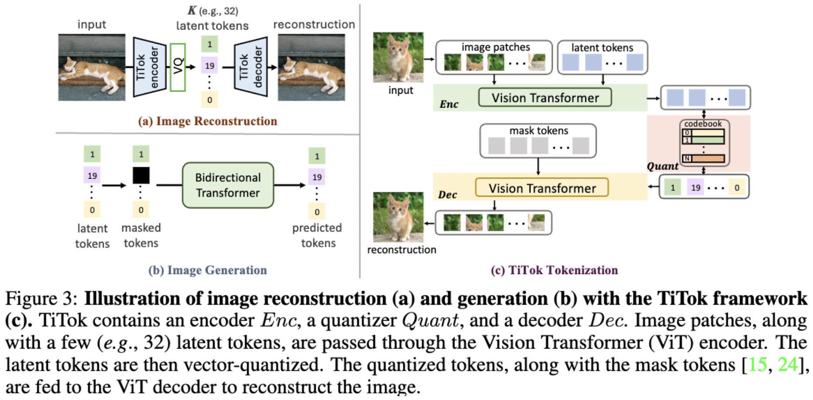

</img>

## TiTok - Pytorch (wip)

Implementation of TiTok, proposed by Bytedance in <a href="https://yucornetto.github.io/projects/titok.html">An Image is Worth 32 Tokens for Reconstruction and Generation</a>

## Usage

```python
import torch
from titok_pytorch.titok import TiTokTokenizer

images = torch.randn(2, 3, 256, 256)

titok = TiTokTokenizer(dim = 512)

loss = titok(images)
loss.backward()

# after much training
# extract codes for gpt, maskgit, whatever

codes = titok.tokenize(images)

# reconstructing images from codes

recon_images = titok.codebook_ids_to_images(codes)

assert recon_images.shape == images.shape
```

## Citations

```bibtex
@article{yu2024an,
  author    = {Qihang Yu and Mark Weber and Xueqing Deng and Xiaohui Shen and Daniel Cremers and Liang-Chieh Chen},
  title     = {An Image is Worth 32 Tokens for Reconstruction and Generation},
  journal   = {arxiv: 2406.07550},
  year      = {2024}
}
```
